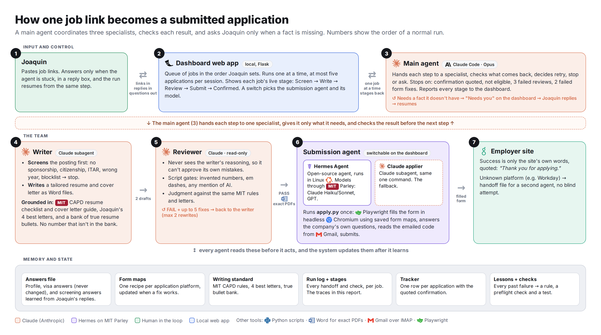

# Job application agent

A small team of AI agents that takes one job link and returns a submitted
application: a tailored resume and cover letter, a filled application form, and
proof the employer received it. Built by Joaquin Laria (MIT Sloan MBA 2027) for
MAS.665 AI Studio, Homework 1 (launch an agent) and Homework 2 (engineer a
reliable agent).

> **Homework 3 (make your agent autonomous):** see
> [`forum_agent/README.md`](forum_agent/README.md): the scheduled Canvas forum
> agent, its linked posts, run evidence and failure-recovery demo.

> **Personal data lives in a private repo.** This public repo holds the general
> code, instructions and tests. The answers file (profile, visa answers),
> resumes, cover letters, run logs, screenshots, the homework report and the demo
> video are in
> [`JoaquinLaria/job-application-agent-private`](https://github.com/JoaquinLaria/job-application-agent-private),
> which needs access. Passwords and API keys are in neither repo.



## What it does

1. **Dashboard** (`dashboard/`, local Flask app): paste job links, order the
   queue, watch each job move through Screen → Write → Review → Submit →
   Confirmed, answer the agent in a reply box when it is stuck, and switch which
   agent submits.
2. **Main agent** (`CLAUDE.md`, Claude Code): hands each step to a specialist,
   checks every result, decides retry, stop or ask.
3. **Writer** (`.claude/agents/writer.md`): screens the posting for eligibility
   (sponsorship, citizenship, ITAR, graduation year), then writes the resume
   and cover letter from a bank of true facts.
4. **Reviewer** (`.claude/agents/reviewer.md`): read-only, never sees the
   writer's reasoning; runs `applier/review.py` and judges against the writing
   standard. FAIL sends fixes back, at most twice.
5. **Submitter**: Hermes Agent on MIT's Parley gateway (`applier/hermes_submit.py`)
   or a Claude subagent (`.claude/agents/applier.md`), chosen in
   `submitter.json`. Either one runs `applier/apply.py`, which fills the form
   with Playwright, reads the emailed security code over IMAP, submits, and
   records success only when the site's own confirmation text appears.

## Results (September 2026)

- Three real applications submitted and confirmed by the employers' sites with
  no help on the final runs.
- Evaluation, 4 test cases × 2 setups, nothing submitted: on a job it had seen,
  questions needed from the human went from 3 to 0 because answers are kept; on
  new jobs both setups needed about five. The held-out case found four bugs,
  including one false answer, all fixed and covered by tests. Details in
  `evals/` and in the private repo's report.

## Repo map

| Path | What it is |
|---|---|
| `CLAUDE.md` | Main agent: the loop, stop rules, when to ask, lessons from real runs |
| `.claude/agents/` | Writer, reviewer and Claude applier subagents |
| `submitter.json` | Which agent submits (`hermes` or `claude`) and with which model |
| `dashboard/` | Queue web app (`app.py`), page (`index.html`), stage reporter (`stage.py`), mock agent |
| `applier/apply.py` | One call per application: build job, fill form, read code, submit |
| `applier/fill.py` | Playwright form engine: recipes, label matcher, uploads, code wait |
| `applier/prepare_run.py` | Detects platform, applies URL rewrites, writes job.json |
| `applier/recipes/` | Saved form maps per application platform (per-company answers removed) |
| `applier/ANSWERS.example.json` | The answers file's shape, every value redacted |
| `applier/gmail_code.py` | Reads the newest security code over IMAP |
| `applier/docx_to_pdf.py` | Word to PDF with a hard timeout |
| `applier/review.py` | Hard quality gates for resumes and letters |
| `preflight.py` | 12 live checks before a session |
| `tests/` | 19 regression tests, one per real failure (2 need the private answers file) |
| `evals/` | Eval runner and scorer used for the homework comparison |
| `AGENTS.md` | Guide for AI agents working on this repo |

## Run it

**Without any accounts** (anyone, any OS with Python 3.11+):

```bash
pip install -r requirements.txt
python -m unittest discover -s tests      # 17 pass, 2 skip without the private answers file
python dashboard/app.py --mock            # http://127.0.0.1:5057, fake agent, applies nowhere
```

**Full system** (what the author runs, Windows 11 + WSL2):

1. Claude Code, Microsoft Word (for exact PDFs), WSL2 Ubuntu with a Python venv
   at `/opt/career/.venv` holding `playwright` and `python-docx`
   (`playwright install chromium`).
2. Copy `applier/ANSWERS.example.json` to `applier/ANSWERS.json` and fill it in.
3. Set `CAREER_DIR` to the folder that holds `01. Resume and Cover Letters/`,
   `QUEUE.txt` and `APPLICATIONS.csv`.
4. Gmail app password for IMAP in `~/.career_secrets/gmail.json`
   (`{"user": "...", "app_password": "..."}`), or set `CAREER_GMAIL_SECRETS`.
5. Optional Hermes submitter: install Hermes Agent in WSL and point it at an
   OpenAI-compatible endpoint (the author uses MIT Parley).
6. `python preflight.py`, then `Start Application Dashboard.bat`.

Test mode that fills forms but can never submit: `python dashboard/app.py --no-submit`,
or set `APPLIER_FORCE_NO_SUBMIT=1` (forward it to WSL with `WSLENV`).
